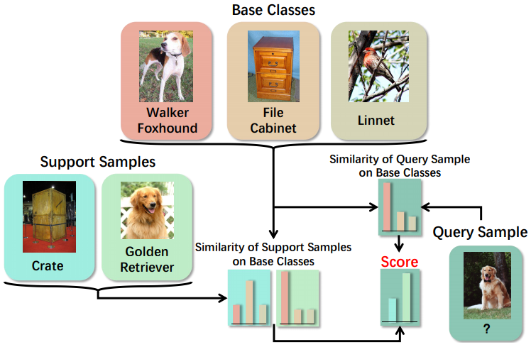

# CBM
中文版说明请点击[这里](#简介)
## Introduction
This repository contains the code for the paper:
<br>
[**Cooperative Bi-path Metric for Few-shot Learning**](https://arxiv.org/abs/2008.04031)
<br>
Zeyuan Wang, Yifan Zhao, Jia Li, Yonghong Tian
<br>
ACM Conference on Multimedia (ACM MM), 2020
<p align='center'>
  
</p>

## Environments
* **python = 3.6**

* **pytorch = 1.6**

* **scikit-learn = 0.23**

* **python-lmdb = 0.96**
## Datasets: 

* **miniImageNet (in the form of `.pickle`)**:

    Link: https://github.com/gidariss/FewShotWithoutForgetting

* **tieredImageNet (in the form of `.jpg`)**:

    Link: https://github.com/renmengye/few-shot-ssl-public
## Steps

### 1. Set the Paths
* **Change the variable `dataset_dir` in configuration file `./torchFewShot/datasets/miniImageNet_load.py` to the correct path to miniImageNet.**
* **Change the variable `dataset_dir` in configuration file `./torchFewShot/datasets/tieredImageNet.py` to the correct path to tieredImageNet.**
* **Change the variable `file` in `save_base_proto.py.py` to the correct path to the train set file of miniImageNet.**
  
If you want to test our trained models, please go straight to steps 4.

### 2. Train Models
train baseline++ on miniImageNet for 5-shot
```
python train.py mini --nExemplars 5
```
train baseline++ on miniImageNet for 1-shot
```
python train.py mini --nExemplars 1
```
train baseline++ on tieredImageNet for 5-shot
```
python train.py tiered --nExemplars 5
```
train baseline++ on tieredImageNet for 1-shot
```
python train.py tiered --nExemplars 1
```
### 3. Save Feature Vectors of Base Classes
save feature vectors of base classes of miniImageNet for 5-shot
```
python save_base_proto.py mini --nExemplars 5
```
save feature vectors of base classes of miniImageNet for 1-shot
```
python save_base_proto.py mini --nExemplars 1
```
### 4. Test Methods
test baseline++ on miniImageNet for 5-shot
```
python test.py mini --nExemplars 5
```
test baseline++ on miniImageNet for 1-shot
```
python test.py mini --nExemplars 1
```
test baseline++ on tieredImageNet for 5-shot
```
python test.py tiered --nExemplars 5
```
test baseline++ on tieredImageNet for 1-shot
```
python test.py tiered --nExemplars 1
```
test CBM on miniImageNet for 5-shot
```
python test.py CBM_5_shot
```
test CBM on miniImageNet for 1-shot
```
python test.py CBM_1_shot
```
test CBM_LLE on miniImageNet for 5-shot
```
python test.py CBM_LLE_5_shot
```
test CBM_LLE on miniImageNet for 1-shot
```
python test.py CBM_LLE_1_shot
```
## Citation
If you use this code for your research, please cite our paper:
```
@inproceedings{DBLP:conf/mm/WangZ0020,
  author    = {Zeyuan Wang and
               Yifan Zhao and
               Jia Li and
               Yonghong Tian},
  editor    = {Chang Wen Chen and
               Rita Cucchiara and
               Xian{-}Sheng Hua and
               Guo{-}Jun Qi and
               Elisa Ricci and
               Zhengyou Zhang and
               Roger Zimmermann},
  title     = {Cooperative Bi-path Metric for Few-shot Learning},
  booktitle = {{MM} '20: The 28th {ACM} International Conference on Multimedia, Virtual
               Event / Seattle, WA, USA, October 12-16, 2020},
  pages     = {1524--1532},
  publisher = {{ACM}},
  year      = {2020},
  url       = {https://doi.org/10.1145/3394171.3413946},
  doi       = {10.1145/3394171.3413946},
  timestamp = {Thu, 15 Oct 2020 16:32:08 +0200},
  biburl    = {https://dblp.org/rec/conf/mm/WangZ0020.bib},
  bibsource = {dblp computer science bibliography, https://dblp.org}
}
```
## Acknowledgments
This code is based on the implementations of [**Cross Attention Network for Few-shot Classification**](https://github.com/blue-blue272/fewshot-CAN).
***
## 简介
本代码仓库是对以下论文的实现:
<br>
[**Cooperative Bi-path Metric for Few-shot Learning**](https://arxiv.org/abs/2008.04031)
<br>
Zeyuan Wang, Yifan Zhao, Jia Li, Yonghong Tian
<br>
ACM Conference on Multimedia (ACM MM), 2020
<p align='center'>
  
</p>

## 环境
* **python = 3.6**

* **pytorch = 1.6**

* **scikit-learn = 0.23**

* **python-lmdb = 0.96**
## 数据集: 

* **miniImageNet (以`.pickle`格式)**:

    地址: https://github.com/gidariss/FewShotWithoutForgetting

* **tieredImageNet (以`.jpg`格式)**:

    地址: https://github.com/renmengye/few-shot-ssl-public
## 流程

### 1. 设置路径
* **改变文件 `./torchFewShot/datasets/miniImageNet_load.py` 中的变量 `dataset_dir`，指向miniImageNet。**
* **改变文件 `./torchFewShot/datasets/tieredImageNet.py` 中的变量 `dataset_dir`，指向tieredImageNet。**
* **改变文件 `save_base_proto.py.py` 中的变量 `file`，指向miniImageNet的训练集的pickle文件。**
  
如果你想直接测试不同方法的准确率，请直接跳转到[步骤4](#4.-测试不同的方法)。

### 2. 训练模型
train baseline++ on miniImageNet for 5-shot
```
python train.py mini --nExemplars 5
```
train baseline++ on miniImageNet for 1-shot
```
python train.py mini --nExemplars 1
```
train baseline++ on tieredImageNet for 5-shot
```
python train.py tiered --nExemplars 5
```
train baseline++ on tieredImageNet for 1-shot
```
python train.py tiered --nExemplars 1
```
### 3. 保存基础类别的特征向量
save feature vectors of base classes of miniImageNet for 5-shot
```
python save_base_proto.py mini --nExemplars 5
```
save feature vectors of base classes of miniImageNet for 1-shot
```
python save_base_proto.py mini --nExemplars 1
```
### 4. 测试不同的方法
test baseline++ on miniImageNet for 5-shot
```
python test.py mini --nExemplars 5
```
test baseline++ on miniImageNet for 1-shot
```
python test.py mini --nExemplars 1
```
test baseline++ on tieredImageNet for 5-shot
```
python test.py tiered --nExemplars 5
```
test baseline++ on tieredImageNet for 1-shot
```
python test.py tiered --nExemplars 1
```
test CBM on miniImageNet for 5-shot
```
python test.py CBM_5_shot
```
test CBM on miniImageNet for 1-shot
```
python test.py CBM_1_shot
```
test CBM_LLE on miniImageNet for 5-shot
```
python test.py CBM_LLE_5_shot
```
test CBM_LLE on miniImageNet for 1-shot
```
python test.py CBM_LLE_1_shot
```
## 引用
如果你使用了该代码，请以下列各式引用我们的论文：
```
@inproceedings{DBLP:conf/mm/WangZ0020,
  author    = {Zeyuan Wang and
               Yifan Zhao and
               Jia Li and
               Yonghong Tian},
  editor    = {Chang Wen Chen and
               Rita Cucchiara and
               Xian{-}Sheng Hua and
               Guo{-}Jun Qi and
               Elisa Ricci and
               Zhengyou Zhang and
               Roger Zimmermann},
  title     = {Cooperative Bi-path Metric for Few-shot Learning},
  booktitle = {{MM} '20: The 28th {ACM} International Conference on Multimedia, Virtual
               Event / Seattle, WA, USA, October 12-16, 2020},
  pages     = {1524--1532},
  publisher = {{ACM}},
  year      = {2020},
  url       = {https://doi.org/10.1145/3394171.3413946},
  doi       = {10.1145/3394171.3413946},
  timestamp = {Thu, 15 Oct 2020 16:32:08 +0200},
  biburl    = {https://dblp.org/rec/conf/mm/WangZ0020.bib},
  bibsource = {dblp computer science bibliography, https://dblp.org}
}
```
## 致谢
该代码主要基于 [**Cross Attention Network for Few-shot Classification**](https://github.com/blue-blue272/fewshot-CAN) 实现，在此对原作者的工作表示衷心的感谢！